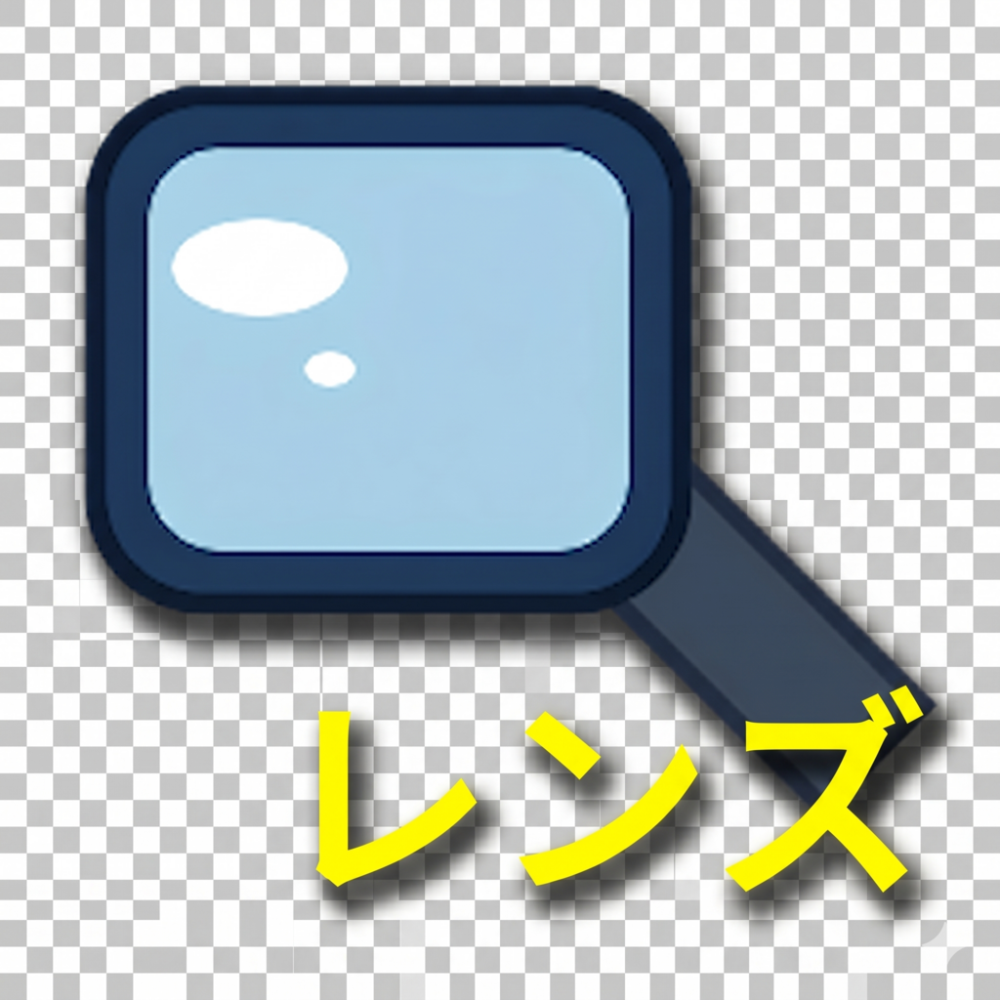
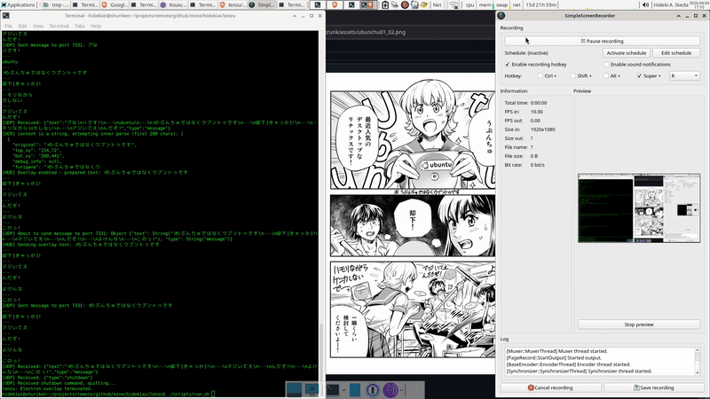
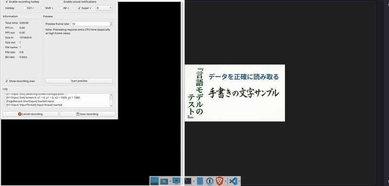
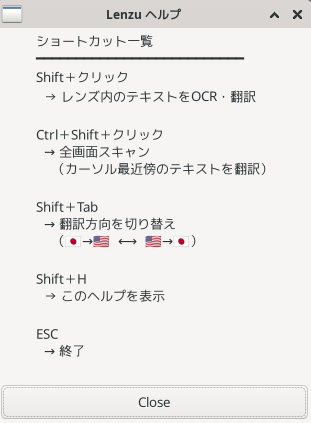

# &nbsp;lenzu 「レンズ」 (LINUX ONLY)

**Install:** grab `lenzu-bundle-X.Y.Z.tar` from the [latest release](https://github.com/CodeMonkeyNinja/lenzu/releases/latest) — quick-start (extract, model installer, `./run.sh`) is on the release page.

**Linux only** (X11, GTK3). No Windows or macOS support.

Desktop OCR lens — a transparent floating window that follows the mouse cursor, captures the region under it on demand, and sends it to a local or remote LLM for OCR and translation. Results appear in a separate transparent overlay HUD (`lenzu_server`).

The key dif:ference from browser extensions like Yomitan/Rikaichan: this operates on **images** (GPU-rendered video, game windows, PDFs, anything on screen), not UTF-8 text.

> **For readers:** Lenzu is a desktop manga reader companion for Linux.
> Point it at any on-screen image — manga page, scanlation viewer, PDF,
> game window — shift+click, and get Japanese OCR with furigana readings
> in a floating overlay. Useful for learning Japanese, reading raw manga,
> and any image-based text that browser extensions like Yomitan or
> Rikaichan can't see (because it's not selectable text).



**`--furigana_only` mode demo** — MeCab furigana only (no LLM enrichment, no translation), ~5 ms per capture after OCR:



*Preview: 15 s excerpt (T=30–45 s) at reduced framerate/resolution. For the full 3 min 24 s demo with audio, [download the MP4](assets/Lenzu-demo-2026-04-19_17.01.52.mp4).*


> **Architecture note**: The Windows/winit/GTK4 experiments are archived in `prototypes/`. The active implementation uses **GTK3** (`gtk-rs` 0.18) on Linux/X11. GTK4 was evaluated and abandoned due to integration complexity — GTK3 provides everything needed and is simpler to build against. See [Technical Design](./docs/technical-design.md) for current architecture.

## Architecture (Current)

```
lenzu (GTK3 client)               lenzu_server (Electron)
  floating lens window     UDP     transparent overlay HUD
  X11 root capture       ──────►  renders translated text
  multi-tier OCR backend           ArrowUp/Down moves position
  manages server lifecycle
```

1. **Capture**: `x11rb` captures the X11 root window directly — bypasses GPU-accelerated and hardware-rendered windows correctly.
2. **OCR/Translation**: Confidence-gated local-first pipeline, then multi-tier LLM fallback:
   - **Local OCR** (`jp_detect` + `manga-ocr-rs`) — if detection confidence >= 71% AND OCR confidence >= 71%, returns immediately. No LLM, no network. Both Shift+Click and Ctrl+Shift+Click paths try this first.
   - **Local LLM primary** (e.g. `gemma4:e2b` via ollama, 3 s) — fully on-device, no API key needed
   - **Local LLM fallbacks** (e.g. `glm-ocr`, `qwen2.5vl`, 3 s each) — smaller OCR-specialist models
   - **Remote fallback** (OpenRouter/Gemini 2.0 Flash, 15 s) — cloud fallback when all local paths fail

   All LLM backends use the same production code path (single source of truth in `client.rs`).  
   Streaming (`"stream": true`) keeps each request's TCP connection alive, preventing ollama's  
   server-side write timeout from firing during slow CPU/partial-GPU inference.

3. **Overlay**: Formatted text sent via UDP loopback to `lenzu_server`, an Electron transparent window pinned to screen edge.

### Privacy modes

| Mode                           | Config                     | API key needed?           | Images leave device? |
| ------------------------------ | -------------------------- | ------------------------- | -------------------- |
| Fully local                    | `OPENROUTER_API_KEY` unset | No                        | No                   |
| Local-first                    | default                    | No (local) / Yes (remote) | Only on fallback     |
| Remote-only (Ctrl+Shift+Click) | any                        | Yes                       | Yes                  |

### Inference speed on typical hardware

| Backend | VRAM | Typical latency | Confidence scoring |
| --- | --- | --- | --- |
| jp_detect + manga-ocr-rs (local, no LLM) | ~150 MB models | ~0.8–2 s per high-confidence crop (CPU) | Det 0-100%, OCR 0-100%; >= 71% both = pass |
| gemma4:e2b — full GPU (8 GB+) | ~7.4 GB | ~15–30 s | N/A (LLM fallback) |
| gemma4:e2b — partial GPU | ~2 GB GPU + CPU | 60–120 s | N/A (LLM fallback) |
| glm-ocr — full GPU (4 GB) | ~2.2 GB | ~5–15 s | N/A (LLM fallback) |
| Gemini 2.0 Flash (remote) | — | ~3–5 s | N/A (LLM fallback) |

The local OCR path (jp_detect + manga-ocr-rs) is tried first for all capture modes. When
both confidence scores pass the 71% gate, no LLM or network call is needed. For 4 GB VRAM
cards, this means most clean text regions are handled in under 2 seconds without touching Ollama.

## Hardware and Privacy

- **Local-first by default**: `ollama` runs on the same machine; no data leaves the device unless the local models fail and you have `OPENROUTER_API_KEY` set.
- **Cloud OCR**: Automatically falls back to OpenRouter (Gemini 2.0 Flash) when local inference times out. Disable by leaving `OPENROUTER_API_KEY` unset.
- **Local-first OCR**: `jp_detect` (DBNet) detects text regions with per-box confidence scores; `manga-ocr-rs` recognizes text with per-result confidence. When both scores pass the 71% gate, no LLM or network is needed.

## Related Crates

These companion crates were developed as part of this project and are available on crates.io:

- [`jp_detect`](https://crates.io/crates/jp_detect) — real-time scene text detection using DBNet (ONNX). Locates text bounding boxes in manga panels and screenshots.
- [`manga-ocr-rs`](https://crates.io/crates/manga-ocr-rs) — Japanese manga OCR via ViT encoder + BERT decoder (ONNX). Converts image crops to Japanese text.
- [`mecab-furigana-rs`](https://crates.io/crates/mecab-furigana-rs) — MeCab-based furigana and romaji annotation. Dictionary-accurate readings at ~5 ms per call, with word segmentation and morpheme data.

See [OCR Accuracy Scores](https://github.com/CodeMonkeyNinja/lenzu/blob/trunk/docs/scores.md) for unified benchmark results across all engines and prototypes.

## Libraries & Dependencies

- [`gtk` 0.18](https://crates.io/crates/gtk) — GTK3 bindings (gtk-rs). **GTK3, not GTK4.**
- [`x11rb`](https://crates.io/crates/x11rb) — X11 protocol (screen capture)
- [`cairo-rs`](https://crates.io/crates/cairo-rs) — 2D drawing
- [`pango`](https://crates.io/crates/pango) / [`pangocairo`](https://crates.io/crates/pangocairo) — text layout and CJK rendering
- [`reqwest`](https://crates.io/crates/reqwest) — HTTP client (OpenRouter API)
- [`isolang`](https://crates.io/crates/isolang) — ISO 639-3 language codes
- Electron (`lenzu_server`) — transparent overlay window

## Build & Run

```bash
# 1. Install system dependencies
./scripts/setup.sh

# 2. Set API key
export OPENROUTER_API_KEY=sk-your-key-here

# 3. Build and run (builds lenzu_server on first run)
./scripts/run.sh
```



See [`lenzu/README.md`](lenzu/README.md) for full configuration reference and controls.

## Why Electron for the HUD (and not GTK)?

Short answer: WebKit2GTK has an unfixable alpha-compositing bug on X11, raw GTK + Cairo lacks an animation ecosystem, and Electron is the only option that cleanly handles all current and planned HUD features.

### What was tried (see `HidekiAI/lenzu-prototypes` archive)

- **Tauri + WebKit2GTK** — abandoned. WebKit's dirty-rect compositor treats `transparent → transparent` as a no-op and skips writing vacated alpha pixels back to the X11 surface. When shorter text replaces longer text the old characters stay on screen until an `Alt+Tab` forces a repaint. Three separate mitigations (near-zero background, body-background tick-toggle, synthetic X11 Expose event) all failed under different timing conditions. Root cause is architectural in WebKit's software renderer — not fixable from application code.
- **GTK3 + Cairo** — doesn't have the dirty-rect bug (the Lenzu lens window is itself a transparent GTK3 + Cairo window and works fine), but see the capability comparison below for why it falls short for the HUD.

### Why GTK + Cairo can't match Electron here

**Transparent borderless window** — both can do it. That's where the parity ends.

**Animated avatar (planned — Clippy-style character).** GTK + Cairo means writing an animation runtime from scratch: load a sprite sheet or PNG sequence, drive frame advances with `glib::timeout_add`, implement every state transition (idle → react → annoyed) by hand in a custom draw callback. No interpolation, no rigging, no off-the-shelf character format.

Electron has the full web animation stack: CSS keyframes, `requestAnimationFrame` canvas sprites, GIF/WebP playback, **Lottie** (Adobe After Effects exported to JSON — the standard format for Clippy-grade rigged character animations), Spine 2D / DragonBones web runtimes for bone animation, WebGL for anything 3D. Reaction states wire up in a few lines of JS.

**Click-through with selective interception.** GTK uses `input_shape_combine_region` to define an X11 input region — static, synchronous, has to be manually recalculated and re-applied every frame when the avatar changes shape.

Electron has `setIgnoreMouseEvents(true, { forward: true })` which passes all clicks through to whatever is underneath, and you toggle it dynamically from a `mousemove` listener:

```ts
// clicks pass through by default; avatar captures them when hovered
win.setIgnoreMouseEvents(true, { forward: true });
avatar.addEventListener('mouseenter', () => win.setIgnoreMouseEvents(false));
avatar.addEventListener('mouseleave', () => win.setIgnoreMouseEvents(true, { forward: true }));
```

That is the entire selective click-interception logic. If the avatar gets bombarded with clicks, a JS counter and a CSS class change express the "annoyed" state — no X11 region recalculation per frame.

**Dynamic font, color, and size changes.** Both can do it. GTK requires a Pango markup rebuild and a `queue_draw()`. Electron is one CSS variable assignment.

### Verdict

| Feature | GTK + Cairo | Electron |
|---|---|---|
| Transparent borderless window | ✓ | ✓ |
| ARGB compositing (no ghost text) | ✓ | ✓ |
| Click-through + selective interception | manual X11 shape mask per frame | one API call + `mousemove` |
| Sprite / frame animation | hand-coded timer loop | trivial (Canvas, CSS, GIF/WebP) |
| Rigged character animation (Clippy-grade) | not practical | Lottie, Spine, DragonBones |
| State-driven reactions (idle → annoyed) | hand-coded state machine + redraw | CSS class + JS state |
| Dynamic font / color / size | Pango rebuild + `queue_draw()` | one CSS variable |

Electron is the correct substrate for everything the HUD does today (transparent text overlay, top/bottom repositioning) and everything planned (animated avatar, reaction states). The HUD stays Electron.

## Why X11 (and not Wayland)?

Short answer: Wayland's security model deliberately forbids the three things
Lenzu's lens depends on. It's not an oversight or laziness — a sandboxed Wayland
client simply isn't allowed to do them:

1. **Track the global cursor.** Lenzu polls the pointer position ~60×/sec so the
   lens follows your mouse anywhere on screen. A Wayland client can only see the
   cursor while it's *over its own window* — it can't know where your mouse is on
   someone else's window or the desktop.
2. **Place its own window under the cursor.** Lenzu moves the lens to absolute
   screen coordinates to sit over whatever you're pointing at. Wayland clients
   can't position their own toplevel windows at arbitrary screen coordinates at
   all (positioning is the compositor's job).
3. **Capture the region silently.** Lenzu grabs the pixels under the cursor
   directly. On Wayland that requires going through xdg-desktop-portal
   (ScreenCast/Screenshot) with a permission prompt — there's no silent,
   on-demand, cursor-following grab.

A Wayland port is therefore not a drop-in: it would mean a redesigned
interaction model (e.g. a global-shortcut-triggered, portal-mediated full-screen
scan) rather than the current "lens follows your cursor, shift-click anywhere"
flow. See the TODO note below.

For now Lenzu runs great under **XWayland** on a Wayland session — but note that
XWayland can only capture other XWayland (X11) windows, not native Wayland
windows, so OCR of Wayland-native apps won't work that way.

## Roadmap

Tracked in [GitHub Issues](https://github.com/CodeMonkeyNinja/lenzu/issues).

## License

| Component | License |
|---|---|
| Lenzu (Rust client binary) | MIT |
| lenzu-hud (Electron HUD) | MIT |
| DBNet ONNX model (`stabrise-text_detection_dbnet_ml_v02_model.onnx`) | **AGPL-3.0** — shipped as a separate sidecar, not bundled in the MIT AppImage |
| manga-ocr ONNX models (`mayocream/manga-ocr-onnx`) | Apache-2.0 |
| MeCab + IPADIC dictionary | BSD-3-Clause / BSD-style (system package, dynamically linked) |
| GTK3, Cairo, Pango, GLib | LGPL-2.1+ (system packages, dynamically linked) |
| Electron / Chromium | MIT + BSD variants (see Electron's own license) |

Full per-crate and per-dependency attribution is in [`lenzu/NOTICES.md`](lenzu/NOTICES.md) (also accessible in-app via **Shift+H → About**).

## History

Lenzu was originally developed at
[`HidekiAI/lenzu`](https://github.com/HidekiAI/lenzu), which has since been
renamed to
[`HidekiAI/lenzu-prototypes`](https://github.com/HidekiAI/lenzu-prototypes).
The product code — Rust GTK lens, Electron HUD, packaging, release pipeline
— was extracted here in May 2026 for canonical ownership alongside sibling
crates like [`manga-ocr-rs`](https://github.com/CodeMonkeyNinja/manga-ocr-rs).
The prototype crates that informed Lenzu's design (winit, gtk4, sarashina-onnx,
dbnet-test, mecab, manga-ocr-test, and more) remain in the original repo as
an archive.
